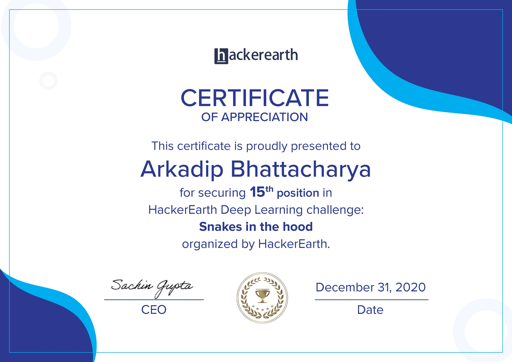

<h1 align="center">Hackerearth Snakes in the hood</h1>

A Artifical Neural Network created using `PyTorch` that can classify between 35 snake breeds.

- Used: `PyTorch` and `SkLearn`
- `ResNet50` based CNN model
- F1 Score: `46.79708`
- Hackathon Position: `15`

<h2 align="center">Certificate</h2>

